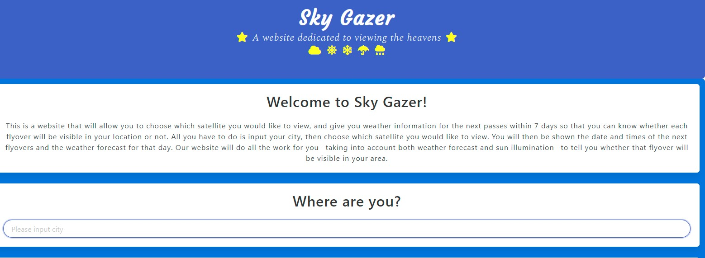
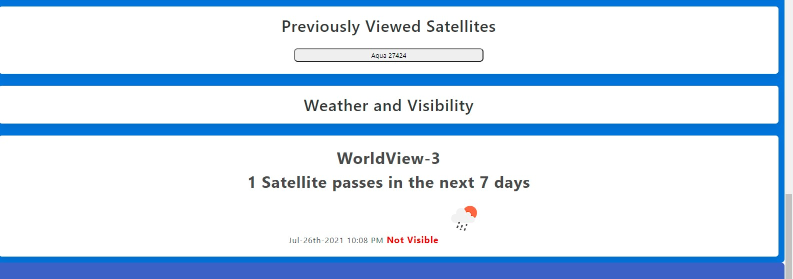

# Welcome to Sky-Gazer

### As a user I want to view satellites as they move across the sky in their particular location. The user will input their location and the site will return back information about the location of the satellite and the time of day of the next fly over and will pair with weather data to determine if the user will be able to see the satellite when it flies over in their particular location.
---

## Table of Contents
 * [Technologies](#technologies)
 * [Screen Shot](#screen-shot) 
 * [Click here to visit the site!](https://pamtheham.github.io/Sky-Gazer/)
---

## Technologies 
><b>Development Tools:</b>
 * <b>Framework:</b> Bulma

><b>APIs:</b>
 * [Spectator Earth](https://spectator.earth/)
 * [Satellite Passes](https://satellites.fly.dev/)
 * [Open Weather Geocoding](https://openweathermap.org/api/geocoding-api)
 * [Open Weather One Call](https://openweathermap.org/api/one-call-api)
 

---

## Screen Shot

---

[Back to Top](#welcome-to-sky-gazer)
